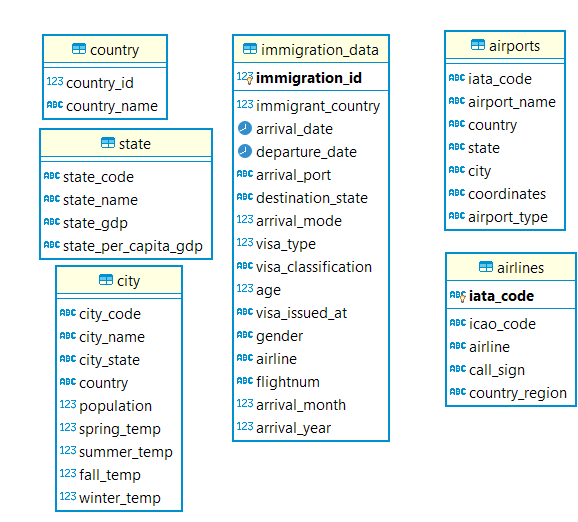

# USA Immigration data processing
## Overview

U.S. customs and border protection have large amounts of data around immigration  into United states. They’d want to be able analyse this data and find answers to some questions around this data. 

The purpose of this project is to process & persist into an easily queryable analytical database the USA immigration data, made available by U.S. customs and border protection. Data available is about the immigrants coming through to USA at various ports of entry. The goal of the project is to gather this data, clean the data wherever necessary, enrich it and process data into an analytical database with a data pipeline. 

### Scope the Project and Gather Data:

The idea behind the project is to gather the data that US Customs and Border protection is providing enrich it with additional sources, build a data pipeline which can be scheduled to run at a preset frequency and pesist data into an analytical database. For building the pipeline, Apache Airflow, which is a Python platform for Programmatically authoring, scheduling and monitoring workflows is used.

**Choice of technology stack:**

This implementation is built to create a datawarehouse materialized as parquet files (Tables) saved on local disks. It would be fairly straightforward to change the implementation to save the data on cloud data lakes, like AMAZON S3. Alternatively, pipeline can be modified to save data to an on-prem RDBMS like postgres. Additional steps would be to create the tables and change the code to save data to postgres. Another option would be to create a star schema of tables on cloud based columnar analytical databases such as AMAZON Redshift. As Amazon redshift is based on Postgres, changing the pipeline to push data on to Redshift would be easy. Also, airflow provides hooks for S3, postgres & Redshift, which simplifies configuring & connecting to these endpoints. Pipeline is built with Python and orchestrated using Apache Airflow platform.

**Questions the database is built to answer:**

Some of the questions the database is built to answer.

    • What cities do most people visit?
    • What ports do most immigrants arrive at?
    • What seasons bring in most immigrants?
    • Do business travellers visit wealthier states?
    • Which countries bring in more student immigrants?
    • What's the average stay time for different categories of visitors?
    • Which airline ferries most immigrants
    • What is the composition of sexes among student immigrants?
    • Which states get more student travellers?
    • What's the breakup of visitors at airports?

     
    

To be able to answer questions like the ones above, apart from the immigration data itself, data about Airlines (sourced from the internet), Airports (sourced from internet), State (enriched with GDP related data sourced from internet, apart from that provided by the agency), Country (provided by the agency), City (using City data & temperature data provided by the agency) are used. 

Data is organized into a Star schema analytical database, with Immigration data as the fact in the center, with Coutry, State, City, Airports & Airlines as the dimensions referenced in the fact.

Project in its essence is an Apache Airflow data pipeline, built with Python. The pipeline is scheduled to run monthly and process data into parquet files. Data is laid out to form a star schema with one file each for dimensions & one partitioned file for the fact table.
Following are the details of the dimension & Fact tables, their sources & metadata.

##  Data model in detail

**Airports:**

Data source: 
https://datahub.io/core/airport-codes#data CSV available at this source for download.

source data file: raw_data/airport-codes_csv.csv

Table file : airports.parquet

| Column | Datatype | Description
| ----------- | ----------- | ----|
| iata_code | string | IATA* airport code|
| airport_name | string | Name of the airport|
| country | string | Airport country|
| state | string | Airport state|
| city | string | Airport city|
| coordinates | string | Latitude & Longitude of airport|
| type | string | Type of airport, small, large, heliport etc|

*Internation air transport association

Data choice:

To enable ananlysis of immigration to specific airports. This data in conjunction with seasonality would enable the department to plan staffing. Also, provides details of airports.

Data munging: 

Subset of columns in the CSV are used. Processing & cleaning part of process_dimensions operator.

**Airlines:**

Data source: https://en.wikipedia.org/wiki/List_of_airline_codes . 

source data file: raw_data/airlines.csv

Table file : airlines.parquet

| Column | Datatype | Description
| ----------- | ----------- | ----|
| iata_code | string | IATA* code for airlines|
| icao_code | string | ICAO** code for airlines|
| airline | string | Name of the airline|
| call_sign | string | Name used as call sign for communication|
| country_region | string | Airline's origin country|

*Internation air transport association
**International Civil Aviation organization

Data choice:

Airlines dimension is chosen, as it would enable analysis of numbers brought in by various airlines. This in conjunction with destination of travellers arriving from specific airlines could throwup intersting insights. Airline dimension provides more imformation about the airlines, which can be enriched further without major changes to the warehouse or the pipeline.

Data munging:

From the above link data in HTML Table is copied into an excel, exported as a CSV, imported into a Postgres table, only data with a valid iata_code is retained and exported out to csv for the eventual data load.

**Country:**

Data source: I94CIT & I94RES section of I94_SAS_Labels_Descriptions.SAS.

source data file: country_codes.csv

Table File: country.parquet

| Column | Datatype | Description
| ----------- | ----------- | ----|
| code | number | code for country used in I94|
| country | string | name of country|

Data choice:

This is an obvious choice, as it would country details, especially useful in reports.

Data munging:

From the supplied I94_SAS_Labels_Descriptions.SAS, I94CIT section is copied to a csv. Some entries like those starting with "No Country code" could have been removed, retained to support possible references in old data.

**State:**

Data source: State codes from I94ADDR section ofI94_SAS_Labels_Descriptions.SAS. GDP data from https://en.wikipedia.org/wiki/List_of_states_and_territories_of_the_United_States_by_GDP

source data file: state_codes.csv & us_states_gdp.csv

Table File: state.parquet

| Column | Datatype | Description
| ----------- | ----------- | ----|
| state_code | number | code for state used in I94|
| state_name | string | name of the state|
| state_gdp | string | latest gdp of the state|
| state_per_capita_gdp | string | per capita gdp of the state|

NOTE:  More information like Region the state falls in & Percentage GDP contribution of the state in the country are also available & can be added if there's a need.

Data choice:

This is an obvious choice, as it would State details, especially useful in reports. Data is enriched, so that, correlation between wealth of a state and visitor counts can be made. 

Data munging:

State codes are available in the provided I94_SAS_Labels_Descriptions file, this is copied into its own csv called state_codes.csv. State GDP data is from the link in Data source section in an HTML table. This is copied into an excel & exported as csv for loading the dataframe in code.

**City:**

Data source: I94 port section of I94_SAS_Labels_Descriptions.SAS 

Source files: city_codes.json, us-cities-demographics.csv & GlobalLandTemperaturesByCity.csv

Table file: City.parquet

| Column | Datatype | Description
| ----------- | ----------- | ----|
| city_code | string | code for city used in I94|
| city | string | name of the state|
| state | string | code for the state city belongs to|
| spring_temp | float | Average temperature in the city for March, April & May|
| summer_temp | float | Average temperature in the city for June, July & August|
| fall_temp | float | Average temperature in the city for September, October & Novemeber|
| winter_temp | float | Average temperature in the city for December, January & February|
| population | number | Total population for the city|

Data choice:

Another obvious choice enabling descriptive reporting. Enrichment is brought in with demographics & temperature data, which can be utilized to study if there's a correlation between time of the year (in terms of weather conditions) & visits.

Data munging:

City codes are sourced from the I94_SAS_Labels_Descriptions file. This data was imported into postgres, using "=" as a separator. City name string also has the state name separated by a comma. This string first trimmed, split and First part is saved as city_name & second part as state. Some US state code names have additional characters. They are cleaned using an update like below in postgres.

`update capstone.city_import
set state = left (state,2)
where substring(state from 3 for 1) in ('(','#',' ')
`

Some more data updates done to deal with city names which have bad data.

`update capstone.city_import 
set city_name = 'UNAVAILABLE'
where city_name like 'NOTREPORTED%' or city_name like 'NoPORTCode%'
`

Results from following select is exported as json for consumption in the pipeline code.

`
select city_code, city_name, state
from capstone.city_import ci 
where city_name not like 'UNAVAILABLE%'
`

For city temperatures. All the munging is part of the pipeline code. Data is filtered down to "United States" and average temperatures are calculated for each of the four seasons "sprin, summer, fall & winter" based on the dates of recorder temperatures.

US demographic data is imported and summarized for state & city in the pipeline code.

**Immigration Data**

Data source: Monthly I94 SASDBAT provided.

Source files: i94_jan16_sub.sas7bdat

Table File: immigration_data.parquet, partitioned by arrival_year

| Column | Datatype | Description
| ----------- | ----------- | ----|
| immigration_id | number | Unique number for the immigration, part of I94 file|
| immigrant_country | number |Country code of the immigrant's origin, maps to country_code of country table|
| arrival_date | date | date of immigrant's arrival|
| departure_date | date | date of immigrant's departure|
| arrival_port | string | City code for immigrant's arrival port, maps to city_code of city table|
| arrival_mode | number | 1 = 'Air', 2 = 'Sea', 3 = 'Land', 9 = 'Not reported'|
| visa_type | number | 1 = Business, 2 = Pleasure, 3 = Student|
| age | float | Reported Age of the Immigrant|
| visa_issued_at | number | City code of Embassy where visa was issued. Lots of missing data|
| gender | number |Immigrant's gender|
| airline | string |Code airline on which Immigrant arrived, maps to iata_code airlines table|
| flightnum | string | Total population for the city|
| visa_classification | string |Type of visa, Busines, Student etc|

Data choice:

Data choice is about what to discard & what to retain. All interesting details about the arrival have been retained, as they would enable imaginative exploration.

Data munging:

Only a subset of available fields used & columns renamed.

**Data model diagram:**

**How does the data model answer these question:**

Some of the questions the database is built to answer.

 * What ports do most immigrants arrive at?
  
    `       select c.city_code, c.city_name, count(1) as Visitors
            from immigration_data i join city c
                on c.city_code = i.arrival_port
            GROUP BY c.city_code, c.city_name
            ORDER BY 3 DESC
            limit 10
    ` 
 * What seasons bring in most immigrants?
  
    `
        select case when i.arrival_month in (3,4,5) then 'Spring'
            when i.arrival_month in (3,4,5) then 'Summer'
            when i.arrival_month in (3,4,5) then 'Fall'
            when i.arrival_month in (3,4,5) then 'Winter'
            else '' END season, count(1) as visitors
        from immigration_data i 
        group by case when i.arrival_month in (3,4,5) then 'Spring'
            when i.arrival_month in (3,4,5) then 'Summer'
            when i.arrival_month in (3,4,5) then 'Fall'
            when i.arrival_month in (3,4,5) then 'Winter'
            else '' END season
    `
* Do business travellers visit wealthier states?

    `
            select state_code, state_name, GDP, rank() over (order by GDP desc) wealth_rank
            from state 
    `  

    `
    select state_name, visitors, rank() over (order by visitors desc) visitor_rank
            from     (select destination_state, count(1) visitors
            from immigration_data
            where visa_type = 1
            group by destination_state) state_vist join state on destination_state = state_code
    `

* Which countries bring in more student immigrants?
  
  `select immigrant_country, count(1) students
from immigrant_data 
where visa_type = 3
group by immigrant_country
order by 2 desc 
  `

 * What's the average stay time for different categories of visitors?

    `select visa, avg(stay_days) as average_stay 
    from
    (select case when visa_type = 1 then 'Business'
                when visa_type = 2 then 'Pleasure'
                when visa_type = 3 then 'Student'
                else 'Misc' END, datediff(departure_date, arrival_date) stay_days
    from immigrant_data
    where departure_date is not null)
    group by visa
 `

 * Which airline ferries most immigrants
  
    `select i.airline, a.airline as airline_name, count(1) passengers 
    from immigration_date i join airlines a on i.airline = iata_code
    group by i.airline, a.airline
    `
 
 * What is the composition of sexes among student immigrants?
  
    `select gender, count(1) students
    from immigrant_data
    where visa_type = 3
    group by gender
    `
    
    This can be plotted to see the proportions.
 * Which states get more student travellers?

    `			select state_name, students, rank() over (order by visitors desc) visitor_rank
                from     (select destination_state, count(1) students
                from immigration_data
                where visa_type = 3
                group by destination_state) state_vist join state on destination_state = state_code
                order by 3
    `
 * What's the breakup of visitors at airports?
 
    `			select i.arrival_port, a.airport_name, count(1) as visitors
                from immigrant_data i join airports a on i.arrival_port = a.iata_code
                group by i.arrival_port, a.airport_name
                order by count(1) desc
    `
    

### Data Pipeline

Data pipeline for processing the immigration data is built with Python & orchestrated using airflow. Data is processed into parquet files saved on disk. Following is the graphical representation of the pipeline.

There are 3 tasks in the pipeline

* load_dimension_data: This task loads the parquet files for dimension tables, namely, "country" "state" "airlines" "city" & "airports". Data definition for these are provided above. 
* load_immigration_fact_data: This task loads the Fact table, immigration_data. Appropriate raw data file is picked up based on the execution date of the task.
* check_data_quality: This task is built to check if the data is processed as designed.

Choice of pipeline stack:

Airflow with Python is chosen for the pipeline as it gives a robust platform & flexibility. Processing dimensions & fact is modularized and they can be customized on their own. Dimension process is desinged only to be executed for the first time, and the process is skipped on subsequent pipeline executions. All these is enabled by airflow variables and context data. More importantly, in the future if different destinations are chosen for the warehouse, be it Postgres, Amazon S3 or Redshift, Airflow provides hooks to all these destinations, using which changes can be made easily. Modularity of the design enables specific changes to dimension & fact processing. Airflows ability to backfill will make the switch easy as well.

**Python files & data:**

* process_immigration_data.py: This is the main DAG file, which defines the tasks, sets up the sequencing & scheduling for the tasks. This file is in the airflow/dags folder.
* process_dimensions.py: This python defines the class for ProcessDimensionsOperator, which processes and saves all the dimension tables. This file is in airflow/plugins/operators
* process_immigration_fact.py: This python defines the class for ProcessImmigrantOperator, which processes the montly immigration data sas file.
* raw_data: This folder contains all the raw data for dimensions & fact. The code is built to look for fact data under raw_data/immigration_data/<year_name> folder. For e.g. raw_data/immigration_data/2016 which would hold up to 12 files, one per each month in the year.

NOTE: The immigration_data sas file is not part of the repository, owing to the large size. 

**Set up for Airflow:**

Pipeline expects 3 variables to be set up on airflow. Following are the explanations. Once the airflow process is run, get on to the airflow UI, under admin->variables, add the following variables.

* load_path: String specifying the path from which to raw data is sourced. For e.g. "/home/workspace/raw_data"
* save_path: String specifying the path to which parquet files are saved.
* dimensions_loaded: This needs to be set to 0 initially.

Note: DAG is set up with a start_date of 1st January 2016 & an end_date of 1st February 2016. If the raw data for immigration is available at the appropriate location (see raw_data section above), the DAG will create a DAG run each for 2016 January & February as catchup is set to TRUE. End date (For e.g. to December 2016, which would create a total of 12 DAG runs) can be changed appropriately. Code is designed to ignore processing for immigration data if raw data is absent.

**What if requirements around the project change:**

* *Data was increased by 100x:*  Scaling to this size would require changes to the destination of data. As discussed earlier, obvious choices would be either S3 or Amazon redshift, as both of them offer easy scalability. Amazon Redshift also offers clustering and parallel data load, which can be utilized with smart partitioning of raw data. Spark also offers multi-node cluster option, which can be leveraged.

* *The data populates a dashboard that must be updated on a daily basis by 7am every day:* There are 2 things that can be done here. Firstly, it is fairly easy to change the scheduling for DAGs on airflow to run everyday and populate the appropriate tables before 7am. In this case it can be set to run overnight. In general, dashboards utilize summarized datasets. If these datasets are fixed, another airlfow pipeline can be created which persists summarized datasets, either on S3 as files or as tables on Redshift.

* *The database needed to be accessed by 100+ people:* With amazon redshift adding or removing nodes is fairly easy. Addition of nodes would handle additional workloads easily. If the workloads were to go down, number of nodes can be reduced to save on costs. If the S3 is chosen as the destination, replication can be used to replicate files to multiple different buckets, and users can be routed intelligently.